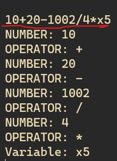
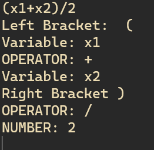

## lexical analysis for arithmetic expression
using Table-Driven to find a set of tokens.

build by Flex(fast lexical analyzer generator) is a free and open-source software alternative to lex.
 It is a computer program that generates lexical analyzers (also known as "scanners" or "lexers").

---- 

###### you can run the program using run script 

flex required to run the program using run script
gcc compiler required to run the program
using the script

There is a compiled file (lexer) you can run it without any prerequisite.

---

----